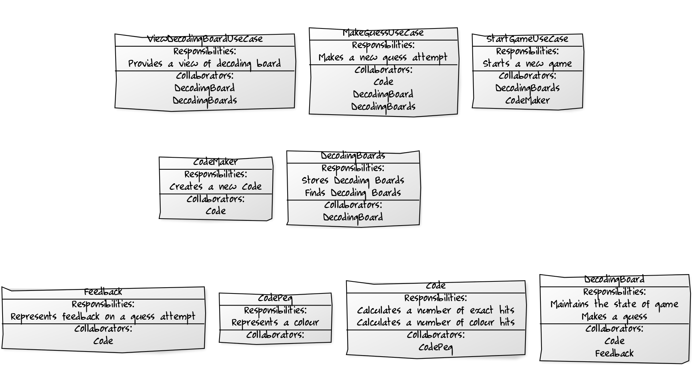

# Exercise 1

Think how you would design a Mastermind game.

If you're not familiar with the game, read through
the [rules](https://en.wikipedia.org/wiki/Mastermind_\(board_game\)) first.

You can also review the acceptance criteria you'll find in
[`features/playing_mastermind.feature`](../features/playing_mastermind.feature).

## Tasks

1. List classes you'd create to implement this game.
2. For each class list its responsibilities.
3. For each class list its collaborators.

## Questions

1. What technical considerations we should make that are not exposed in acceptance criteria?
2. Are there any libraries or frameworks you already have in mind that would help with the implementation?
3. How would you test each of its components?

## Solution

The diagram below presents one of the many possible solutions.

<!--
Diagrams:
* http://yuml.me/edit/2c18bcbf
* http://yuml.me/edit/16c7ae0a
* http://yuml.me/edit/d1e3246b
-->
